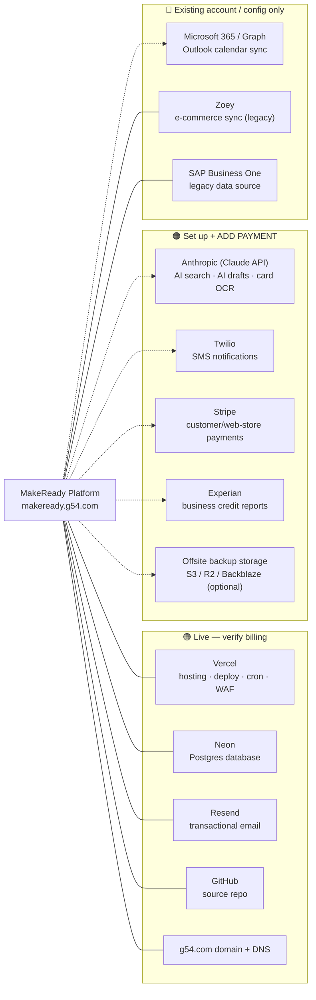

# MakeReady by G54 — External Services, Accounts & Billing

Every third-party service the platform depends on, and **where you need to set up
an account and add payment**. Use this together with the diagram file
`dependency-map.drawio` (open at https://app.diagrams.net — free — or import into
Lucidchart / Visio).

Legend: 🟢 live (account exists, just verify billing) · 🟠 set up + **add payment** ·
🔵 existing account / config only (no new payment).

Last updated: 2026-08-13.

> **What changed 2026-08-13:** several features shipped that now depend on outside
> accounts. **Anthropic** is now actively used (AI search, AI drafts, and OCR
> business-card capture). **Twilio (SMS)** and **Stripe (payments)** are built and
> waiting on accounts + keys. **Microsoft 365 / Graph** is built for Outlook
> calendar sync and needs an app registration (no new payment). All of these
> **degrade gracefully** — the app runs without them; the related feature just
> stays off until its keys are set.

---

## The map (renders on GitHub; Lucidchart can import this Mermaid)

---

## 🟢 Live now — account exists, **verify billing**

| Service | What it does | Account | Payment to confirm | Env / notes |
|---|---|---|---|---|
| **Vercel** | Hosting, automatic deploys from GitHub, Cron (sales automations), edge/WAF | ✅ team `makeready` | **Pro plan (~$20/user/mo)** recommended for production (custom domain, resources, WAF, cron) | `VERCEL_*`, `CRON_SECRET` |
| **Neon** | Serverless Postgres — all app data incl. migrated orders | ✅ | **Paid tier** (compute hours, storage, point-in-time restore/backups). Free tier will throttle production | `DATABASE_URL`, `NEON_PROJECT_ID` |
| **Resend** | Transactional email — invites, quotes, invoices, statements, proofs | ✅ (g54.com verified) | **Paid plan** once volume exceeds free (3k/mo, 100/day) | `RESEND_API_KEY`, domain `g54.com` |
| **GitHub** | Source repository `cwallg54/MakeReady`; Vercel deploys from it | ✅ | Free for private repo; **Team** if you add collaborator seats | — |
| **Domain + DNS: g54.com** | `makeready.g54.com` (→ Vercel) and email auth records (DKIM/SPF/DMARC for Resend) | ✅ registrar | **Domain renewal** | Keep DNS records for Vercel + Resend |

## 🟠 Set up next — **create account and add a payment method**

| Service | What it does | Account | Payment model | Env vars / activation |
|---|---|---|---|---|
| **Anthropic (Claude API)** | **Now in active use.** Powers AI search, AI drafts (art brief, customer summary, email, GL suggestion), and **OCR business-card capture** (Claude vision → new Lead). | ❌ **needed now** | **Usage-based** — add a card or prepay credits at console.anthropic.com (Haiku is the default model → low cost per call) | `ANTHROPIC_API_KEY`. Prefer a **company-owned Team account** with a DPA (see note below). |
| **Twilio (SMS)** | **Built.** Text alerts to customers on order-stage changes, and press-check requests to the art team. | ❌ **needed** | **Usage-based** — ~$1/mo per number + per-message. Add a card at twilio.com and buy one sending number | `TWILIO_ACCOUNT_SID`, `TWILIO_AUTH_TOKEN`, `TWILIO_FROM`. Staff also need a mobile number on their user record for internal texts. |
| **Stripe (payments)** | **Built (inert until keys).** Card payments on the customer portal / web store (server-side Checkout). | ❌ **needed** | **Per-transaction** (~2.9% + 30¢); no monthly fee | `STRIPE_SECRET_KEY`, `STRIPE_WEBHOOK_SECRET` |
| **Experian** (business credit) | Credit recommendation on new accounts (score/risk → suggested limit) | ❌ **needed** (business account) | **Per-report or subscription** | Phase-4 credit-recommendation feature (awaiting a sample report) |
| **Offsite backups** — GitHub Actions (built) → optional S3/R2 | Nightly encrypted `pg_dump` off Neon. Works **today with no new account** (stored as GitHub artifacts) once two repo secrets are set; S3/R2 optional for longer retention | GitHub ✅ / S3 optional | Free (artifacts) · S3 ~$1–5/mo optional | Set `BACKUP_DATABASE_URL` + `BACKUP_PASSPHRASE` — see `DB_BACKUP.md` |

## 🔵 Existing account / config only — **no new payment**

| Service | What it does | Account | Setup needed |
|---|---|---|---|
| **Microsoft 365 / Graph** | **Built.** Outlook calendar sync — folds a rep's Outlook busy times into their booking availability, and pushes booked meetings to their Outlook calendar. | ✅ existing M365 tenant | **App registration in Entra ID** with application permission **Calendars.ReadWrite** + admin consent (no new billing). Then set `MS_GRAPH_TENANT_ID`, `MS_GRAPH_CLIENT_ID`, `MS_GRAPH_CLIENT_SECRET`. |
| **Zoey** | E-commerce sync — push approved contacts to the legacy web store (being replaced by the native store) | ✅ existing store | **API/OAuth credentials** to connect |
| **SAP Business One** | Legacy ERP — origin of the migrated customers, orders, inventory | ✅ existing license | Read/export access for data pulls |

---

## Note — Anthropic company-owned Team account + DPA

Move any AI use (Kim/Brittany, and the platform's `ANTHROPIC_API_KEY`) onto a
**G54-owned Anthropic Team account** rather than personal accounts. A Team account
supports a **Data Processing Agreement (DPA)** — Anthropic contractually won't
train on G54 data — and keeps access under the company if a person leaves. Keep
PHI and financial data out of AI-assisted email regardless. (From the 2026-08-12
consultation with Kim.)

---

## Quick priority order

1. **Confirm billing** on the three that keep the app running: **Vercel, Neon, Resend** (a lapsed card here takes the site or email down).
2. Keep the **g54.com domain** and its DNS records current.
3. **Anthropic** — set up the company Team account + payment now; it's actively powering AI search, AI drafts, and business-card OCR.
4. **Stripe** — account + keys to take customer/web-store payments.
5. **Twilio** — account + a number + payment to turn on SMS alerts.
6. **Microsoft 365 / Graph** — register the Entra app (no new payment) to turn on Outlook calendar sync.
7. Phase-4: **Experian** business-credit account; **Zoey** API credentials (if retaining the legacy store).
8. Security: point nightly backups at **offsite storage** (S3/R2) for longer retention.

## Environment variables at a glance

| Feature | Env vars | Without them |
|---|---|---|
| Core app | `DATABASE_URL`, `RESEND_API_KEY`, `CRON_SECRET` | app won't run / email off |
| AI (search, drafts, card OCR) | `ANTHROPIC_API_KEY` | AI features show a "not set up" message |
| SMS alerts | `TWILIO_ACCOUNT_SID`, `TWILIO_AUTH_TOKEN`, `TWILIO_FROM` | SMS silently skipped (email still sent) |
| Payments | `STRIPE_SECRET_KEY`, `STRIPE_WEBHOOK_SECRET` | pay buttons inert |
| Outlook calendar sync | `MS_GRAPH_TENANT_ID`, `MS_GRAPH_CLIENT_ID`, `MS_GRAPH_CLIENT_SECRET` | booking uses local data only |
| Offsite backups | `BACKUP_DATABASE_URL`, `BACKUP_PASSPHRASE` | nightly dump not stored offsite |
