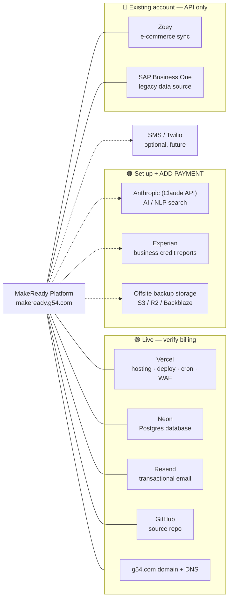

# MakeReady by G54 — External Services, Accounts & Billing

Every third-party service the platform depends on, and **where you need to set up
an account and add payment**. Use this together with the diagram file
`dependency-map.drawio` (open at https://app.diagrams.net — free — or import into
Lucidchart / Visio).

Legend: 🟢 live (account exists, just verify billing) · 🟠 set up + **add payment** ·
🔵 existing account, API access only (no new payment).

Last updated: 2026-08-05.

---

## The map (renders on GitHub; Lucidchart can import this Mermaid)

---

## 🟢 Live now — account exists, **verify billing**

| Service | What it does | Account | Payment to confirm | Env / notes |
|---|---|---|---|---|
| **Vercel** | Hosting, automatic deploys from GitHub, Cron (sales automations), edge/WAF | ✅ team `makeready` | **Pro plan (~$20/user/mo)** recommended for production (custom domain, resources, WAF, cron) | `VERCEL_*`, `CRON_SECRET` |
| **Neon** | Serverless Postgres — all app data incl. 262k migrated orders | ✅ | **Paid tier** (compute hours, storage, point-in-time restore/backups). Free tier will throttle production | `DATABASE_URL`, `NEON_PROJECT_ID` |
| **Resend** | Transactional email — invites, quotes, invoices, statements, proofs | ✅ (g54.com verified) | **Paid plan** once volume exceeds free (3k/mo, 100/day) | `RESEND_API_KEY`, domain `g54.com` |
| **GitHub** | Source repository `cwallg54/MakeReady`; Vercel deploys from it | ✅ | Free for private repo; **Team** if you add collaborator seats | — |
| **Domain + DNS: g54.com** | `makeready.g54.com` (→ Vercel) and email auth records (DKIM/SPF/DMARC for Resend) | ✅ registrar | **Domain renewal** | Keep DNS records for Vercel + Resend |

## 🟠 Set up next — **create account and add payment**

| Service | What it does | Account | Payment | Trigger |
|---|---|---|---|---|
| **Anthropic (Claude API)** | AI features: natural-language search across records, future assistants | ❌ **needed** | **Usage-based** — add a card / prepay credits at console.anthropic.com | Building the NLP search / AI features. Set `ANTHROPIC_API_KEY` |
| **Experian** (business credit) | Credit recommendation on new accounts (score/risk → suggested limit) | ❌ **needed** (business account) | **Per-report or subscription** | Phase 4 credit-recommendation feature (currently awaiting a sample report) |
| **Offsite backup storage** (AWS S3 / Cloudflare R2 / Backblaze B2) | Nightly `pg_dump` copies stored off Neon for disaster recovery | ❌ **needed** | **Usage** (small, ~$1–5/mo) | Security hardening TODO |

## 🔵 Existing account — API access only (no new payment)

| Service | What it does | Account | Payment | Needs |
|---|---|---|---|---|
| **Zoey** | E-commerce sync — push approved contacts to the web store | ✅ existing store | Existing subscription | **API/OAuth credentials** to connect |
| **SAP Business One** | Legacy ERP — origin of the migrated customers, orders, inventory | ✅ existing license | Existing | Read/export access for data pulls |

## ⚪ Optional / future (not required today)

| Service | What it does | When |
|---|---|---|
| **SMS (Twilio or similar)** | Text notifications to customers/staff | Only if SMS is added later |

---

## Quick priority order

1. **Confirm billing** on the three that keep the app running: **Vercel, Neon, Resend** (a lapsed card here takes the site or email down).
2. Keep the **g54.com domain** and its DNS records current.
3. When you want AI search: create an **Anthropic** account and add a payment method.
4. For the remaining Phase-4 features: **Experian** (business credit account) and **Zoey** API credentials.
5. Security: stand up **offsite backup storage** and point nightly dumps at it.
